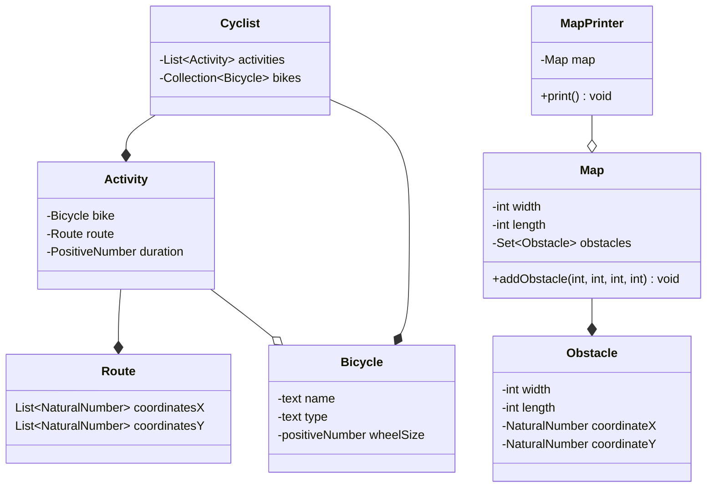

# Narek Veranyan's Exercise Tracker Project

# Vision Statement 
> Build software that allows cyclists to track activities
> over a map, record gear, and measure performance changes over time.

# Resources
* found information about bike types: https://www.edinburghbicycle.com/info/blog/types-of-bikes-buying-guide

## Class Diagram

