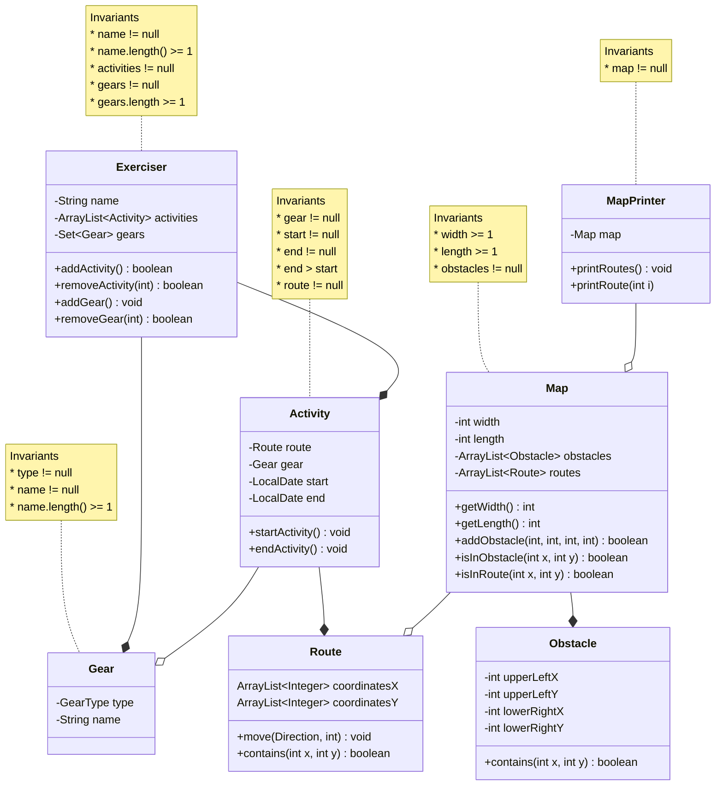

# Narek Veranyan's Exercise Tracker Project

# Vision Statement 
> Build software that allows exercises to track exercises
> over a map, log and share information about their exercises,
> and measure performance over time

# Resources
* found information about bike types: https://www.edinburghbicycle.com/info/blog/types-of-bikes-buying-guide

## Class Diagram

