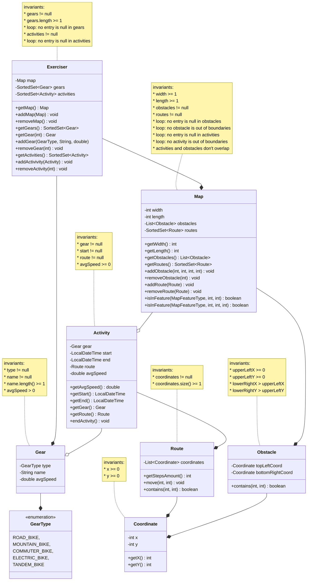

* Title: Track-Me-Riding
* Author: Narek Veranyan (veranyan@myumanitoba.ca)
* Student number: 8040209
* Date: October __, 2025
---

# Overview
> Track-Me-Riding is an implementation of an exercise tracker software for COMP 2450 
> specifically designed for tracking cycling activities. The software offers
>
>   * A user-defined grid-structured map to track an activity.
>   * There are obstacles that can be added to the map.
>   * There are gears to be recorded and later added to an activity.

## Vision Statement
> Build software that allows exercises to track exercises
> over a map, share information about their exercises,
> and measure performance over time.

## Resources
* used the following existing system to come up with classes in the domain model: <https://www.strava.com/>
* found information about bike types: <https://www.edinburghbicycle.com/info/blog/types-of-bikes-buying-guide>

## Running
This project was built using Maven and developed in IntelliJ IDEA.
The project can be run using several options:

1. Open the `Main.java` class and click the green play button 
    in the top right corner.
2. Run Maven on the command line:
    ```
    mvn compile exec:java -Dexec.mainClass="ca.umanitoba.cs.veranyan.Main"   
    ```


# Domain model

Here's my domain model:




